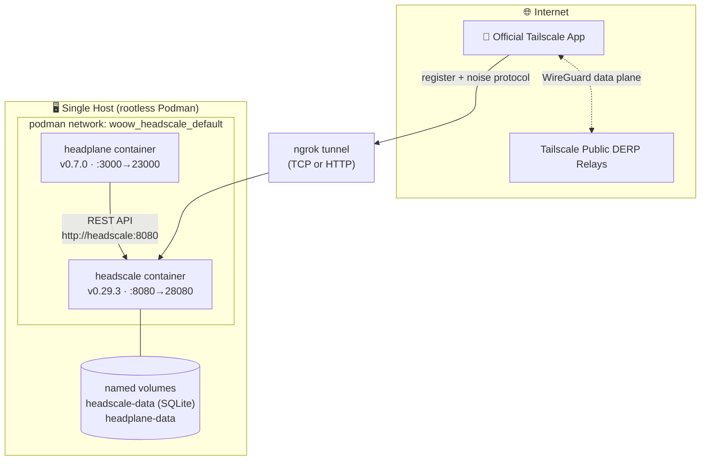

<h1 align="center">Woow VPN Headscale Package — Podman Edition</h1>

<p align="center">
  <strong>Single-Node Self-Hosted VPN — Headscale + Headplane on rootless Podman</strong><br/>
  No Kubernetes required · compatible with the official Tailscale client
</p>

<p align="center">
  <a href="#overview">Overview</a> &bull;
  <a href="#architecture">Architecture</a> &bull;
  <a href="#quick-start">Quick Start</a> &bull;
  <a href="#endpoints">Endpoints</a> &bull;
  <a href="#external-access">External Access</a> &bull;
  <a href="#gotchas">Gotchas</a> &bull;
  <a href="README_zh-TW.md">中文文件</a>
</p>

<p align="center">
  
  
  
  
</p>

> **Branch guide:** you are on the `podman` branch (single-node, no K8s).
> For the multi-tenant **Kubernetes/K3s** stack (operator + CRDs + proxy pods), switch to the [`k3s` branch](https://github.com/WOOWTECH/Woow_vpn_headscale_package/tree/k3s).
> The [`main` branch](https://github.com/WOOWTECH/Woow_vpn_headscale_package) holds the project overview.

---

## Overview

This branch runs the same verified Headscale v0.29.3 + Headplane v0.7.0 stack as the K3s edition, but on a single machine with **rootless Podman** + `podman-compose`. Ideal for home labs, edge boxes, or as a fallback control plane when the cluster is down.

Verified live on Podman 4.9.3 / podman-compose 1.0.6 (Ubuntu): health pass, Headplane login, and **two Tailscale nodes registered — one via the internal network, one via the public internet (ngrok) — pinging each other over WireGuard/DERP**.

## Architecture



## Repository Structure

```
podman branch/
├── podman-compose.yml        # headscale + headplane services
├── deploy.sh                 # one-shot automation
├── scripts/{backup,restore,remove,verify}.sh # lifecycle operations
├── .env.example              # validated operator configuration
├── config/
│   ├── headscale/config.template.yaml # v0.29.3 runtime template
│   ├── headscale/policy.json          # ACL + autoApprovers (file mode)
│   └── headplane/config.template.yaml # v0.7.0 runtime template
├── scripts/runtime_config.py          # validates .env and renders templates
├── runtime/                            # generated configs and secrets (git-ignored)
│   ├── headscale/config.yaml
│   └── headplane/{config.yaml,cookie-secret,api-key}
└── docs/                               # shared docs + screenshots
```

## Quick Start

```bash
git clone -b podman https://github.com/WOOWTECH/Woow_vpn_headscale_package.git
cd Woow_vpn_headscale_package
cp .env.example .env          # optionally set SERVER_URL (ngrok URL / your domain)
./deploy.sh
```

`deploy.sh` validates and renders the runtime configuration, persists Headplane secrets, starts and health-checks Headscale and Headplane, and creates the optional `default` user idempotently. It creates a long-lived Headplane API key only when none has been persisted and validates that exact key on later runs.

## Endpoints

| Service | URL |
|---------|-----|
| Headscale control plane | `http://localhost:28080` (health: `/health`) |
| Headplane admin UI | `http://localhost:23000/admin` |
| Headscale metrics | `http://localhost:29090/metrics` |

<p align="center"></p>

## Connect a Device

Create a device preauth key explicitly, then pass the returned value to Tailscale:

```bash
podman exec headscale headscale preauthkeys create --user default
tailscale up --login-server=<SERVER_URL> --authkey=<preauth-key>
```

## External Access

> **Cloudflare Tunnel will NOT work** for VPN clients — it strips the Tailscale noise-protocol Upgrade header. See [`docs/EXTERNAL-ACCESS.md`](docs/EXTERNAL-ACCESS.md).

The built-in optional ngrok service is controlled entirely through `.env`:

```dotenv
NGROK_ENABLED=true
NGROK_AUTHTOKEN=<token>
NGROK_MODE=http             # http or tcp
NGROK_DOMAIN=vpn.example.ngrok.app  # optional fixed domain; HTTP mode only
```

Run `./deploy.sh`. It starts ngrok, discovers the matching public URL through the loopback-only ngrok API, validates it, and rewrites the effective Headscale `server_url` automatically. TCP mode is exposed to clients as `http://host:port`; use HTTPS HTTP mode for production. Without `NGROK_DOMAIN`, ngrok's random URL can change on every restart, invalidating clients' configured login server until they are updated. A fixed domain is supported only with `NGROK_MODE=http`.

For production, front port 28080 with an upgrade-passing reverse proxy (Traefik / Nginx / Caddy) + TLS and a stable domain. Nginx must pass every non-empty TS2021 Upgrade value, not only `websocket`:

```nginx
map $http_upgrade $connection_upgrade {
    default upgrade;
    '' close;
}
location / {
    proxy_pass http://headscale:8080;
    proxy_http_version 1.1;
    proxy_set_header Upgrade $http_upgrade;
    proxy_set_header Connection $connection_upgrade;
    proxy_buffering off;
}
```

`/health` alone tests ordinary HTTP, not TS2021. Register a real official Tailscale client to validate the Upgrade and Noise handshake.

## Home Assistant parity

| Home Assistant setting/behavior | Podman `.env` / endpoint |
|---|---|
| Tailscale add-on `login_server` | The effective Headscale URL: static `SERVER_URL`, or the automatically discovered ngrok URL |
| Add-on browser registration (no `auth_key` option) | Use the same effective URL; create device preauth keys explicitly only when that client flow needs one |
| HA Ingress admin UI | Headplane at loopback-only `HEADPLANE_HOST_BIND_ADDR=127.0.0.1` and `HEADPLANE_HOST_PORT=23000` (`/admin`); proxy that endpoint through trusted HA ingress rather than exposing it publicly |
| Headscale listen/port | `HEADSCALE_BIND_ADDR`, `HEADSCALE_PORT`; host publication uses `HEADSCALE_HOST_BIND_ADDR`, `HEADSCALE_HOST_PORT` |
| Metrics listen/port | `HEADSCALE_METRICS_BIND_ADDR`, `HEADSCALE_METRICS_PORT`; host publication uses `HEADSCALE_METRICS_HOST_BIND_ADDR`, `HEADSCALE_METRICS_HOST_PORT` |
| Headplane listen/port and secure cookie | `HEADPLANE_BIND_ADDR`, `HEADPLANE_PORT`, `HEADPLANE_HOST_BIND_ADDR`, `HEADPLANE_HOST_PORT`, `HEADPLANE_COOKIE_SECURE` |
| Address pools / MagicDNS / logging | `IPV4_PREFIX`, `IPV6_PREFIX`, `MAGIC_DNS_BASE_DOMAIN`, `LOG_LEVEL` |
| Optional initial user | `CREATE_DEFAULT_USER` |

Cloudflare Tunnel is suitable for the plain-HTTP **Headplane admin UI only**. It is incompatible with the Headscale control plane because it does not preserve the TS2021 POST Upgrade.

## Boot and lifecycle operations

`deploy.sh` installs and enables the current bundled user unit, `woow_headscale.service`. Keep the user manager running after logout:

```bash
systemctl --user enable woow_headscale.service
loginctl enable-linger "$USER"
```

All maintenance commands stop/remove only this stack and never print stored secret values:

```bash
mkdir -m 700 "$HOME/headscale-backups"
./scripts/backup.sh --output "$HOME/headscale-backups"       # cold, atomic backup
./scripts/restore.sh --archive BACKUP.tar.gz --confirm-destructive-restore

git pull --ff-only && ./deploy.sh                            # update/reconcile
./scripts/remove.sh                                          # retain volumes/runtime/.env
./scripts/remove.sh --purge-data --confirm-purge-data         # irreversible data purge
```

Backups are private (`0600`) and must be stored in a private, user-owned directory. Restore accepts only a current-user-owned, non-group/world-writable archive, validates it without sourcing `.env`, preserves a rollback backup, and rolls back automatically if runtime verification fails.

Current durable paths are the exact project-scoped compose volumes `woow_headscale_headscale-data` (SQLite database, WAL/shm, and Headscale noise key) and `woow_headscale_headplane-data`; lifecycle commands require matching compose ownership labels and never select volumes by suffix. Operator/runtime state is `.env`, `config/headscale/policy.json`, and `runtime/` (effective configs, extra records, cookie secret, API key). The pinned images remain Headscale v0.29.3 and Headplane 0.7.0.

## Gotchas

All pre-fixed in these configs — documented for anyone adapting them:

| Issue | Fix baked in |
|-------|--------------|
| Headscale v0.29.3 removed `randomize_client_port` | Key omitted from `config.yaml` (fatal if present) |
| Policy-v2 file mode rejects `"*"` in `autoApprovers` | Uses `default@` username format in `policy.json` |
| Headplane secure-cookie warning breaks HTTP login | `cookie_secure: false` (set `true` behind HTTPS) |
| podman-compose 1.0.6 may not honor `x-podman: in_pod` | Headplane reaches Headscale via the network alias `http://headscale:8080` |
| Headplane v0.7.0 validates `integration.kubernetes.pod_name` even when disabled | No `integration:` section in config |
| `server_url` = `dns.base_domain` domain clash | `base_domain: ts.local` kept separate |

> Runtime-generated configuration and secrets (`runtime/headscale/config.yaml`, `runtime/headplane/config.yaml`, `runtime/headplane/cookie-secret`, `runtime/headplane/api-key`) and the root `.env` are git-ignored — never commit them. Edit `.env` or the versioned `config/*.template.yaml` templates, not generated runtime files.

## Verified Test Matrix

| Test | Result |
|------|--------|
| `curl :28080/health` | ✅ `{"status":"pass"}` |
| Headplane API-key login | ✅ machines dashboard |
| Internal node (compose network) | ✅ `100.64.0.2` registered |
| External node (public internet via ngrok TCP) | ✅ `100.64.0.1` registered |
| Cross-node `tailscale ping` (both directions) | ✅ `pong via DERP(hkg) ~128ms` |

## License

Copyright © 2026 WoowTech (渥屋科技). All rights reserved.
