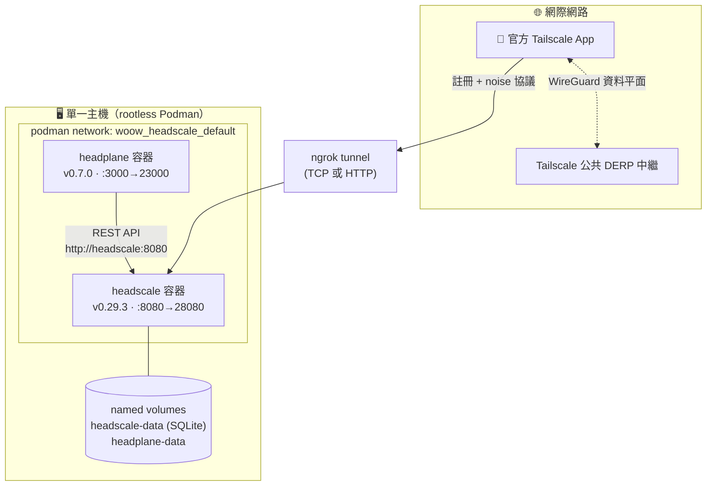

<h1 align="center">Woow VPN Headscale Package — Podman 版</h1>

<p align="center">
  <strong>單機自架 VPN — rootless Podman 上的 Headscale + Headplane</strong><br/>
  不需 Kubernetes · 相容官方 Tailscale 客戶端
</p>

<p align="center">
  <a href="#總覽">總覽</a> &bull;
  <a href="#架構">架構</a> &bull;
  <a href="#快速開始">快速開始</a> &bull;
  <a href="#端點">端點</a> &bull;
  <a href="#外部曝露">外部曝露</a> &bull;
  <a href="#地雷清單">地雷清單</a> &bull;
  <a href="README.md">English</a>
</p>

<p align="center">
  
  
  
  
</p>

> **分支導覽**：你在 `podman` 分支（單機、免 K8s）。
> 多租戶 **Kubernetes/K3s** 版（operator + CRD + proxy pods）請切換到 [`k3s` 分支](https://github.com/WOOWTECH/Woow_vpn_headscale_package/tree/k3s)。
> [`main` 分支](https://github.com/WOOWTECH/Woow_vpn_headscale_package)為專案總覽。

---

## 總覽

本分支在單一機器上用 **rootless Podman** + `podman-compose` 運行與 K3s 版相同且已驗證的 Headscale v0.29.3 + Headplane v0.7.0。適合 home lab、edge 裝置，或作為叢集故障時的備援控制平面。

已在 Podman 4.9.3 / podman-compose 1.0.6（Ubuntu）實測：health 通過、Headplane 登入成功、**兩個 Tailscale 節點註冊 — 一個走內部網路、一個經公網（ngrok）— 並透過 WireGuard/DERP 互 ping**。

## 架構



## 倉庫結構

```
podman branch/
├── podman-compose.yml        # headscale + headplane 服務
├── deploy.sh                 # 一鍵自動化
├── scripts/{backup,restore,remove,verify}.sh # 生命週期操作
├── .env.example              # 經驗證的操作者設定
├── config/
│   ├── headscale/config.template.yaml # v0.29.3 執行期設定模板
│   ├── headscale/policy.json          # ACL + autoApprovers（file mode）
│   └── headplane/config.template.yaml # v0.7.0 執行期設定模板
├── scripts/runtime_config.py          # 驗證 .env 並渲染模板
├── runtime/                            # 產生的設定與 secrets（git-ignored）
│   ├── headscale/config.yaml
│   └── headplane/{config.yaml,cookie-secret,api-key}
└── docs/                               # 共用文件 + 截圖
```

## 快速開始

```bash
git clone -b podman https://github.com/WOOWTECH/Woow_vpn_headscale_package.git
cd Woow_vpn_headscale_package
cp .env.example .env          # 可選：設定 SERVER_URL（ngrok URL / 自有網域）
./deploy.sh
```

`deploy.sh` 會驗證並產生執行期設定、持久保存 Headplane secrets、啟動及健康檢查 Headscale 與 Headplane，並冪等建立可選的 `default` 使用者。僅在尚未保存時建立長效 Headplane API key；之後每次部署都會驗證同一把 key。

## 端點

| 服務 | URL |
|------|-----|
| Headscale 控制平面 | `http://localhost:28080`（health: `/health`）|
| Headplane 管理介面 | `http://localhost:23000/admin` |
| Headscale metrics | `http://localhost:29090/metrics` |

<p align="center"></p>

## 裝置連線

請明確建立裝置 preauth key，再把回傳值交給 Tailscale：

```bash
podman exec headscale headscale preauthkeys create --user default
tailscale up --login-server=<SERVER_URL> --authkey=<preauth-key>
```

## 外部曝露

> **Cloudflare Tunnel 對 VPN 客戶端無效** — 它會剝離 Tailscale noise 協議的 Upgrade header。詳見 [`docs/EXTERNAL-ACCESS.md`](docs/EXTERNAL-ACCESS.md)。

內建的可選 ngrok 服務完全由 `.env` 控制：

```dotenv
NGROK_ENABLED=true
NGROK_AUTHTOKEN=<token>
NGROK_MODE=http             # http 或 tcp
NGROK_DOMAIN=vpn.example.ngrok.app  # 可選固定網域；僅限 HTTP 模式
```

執行 `./deploy.sh`。它會啟動 ngrok，經僅限 loopback 的 ngrok API 找到相符公網 URL、驗證後自動改寫 Headscale 的有效 `server_url`。TCP 模式提供給客戶端的是 `http://host:port`；正式環境請使用 HTTPS HTTP 模式。未設 `NGROK_DOMAIN` 時，ngrok 隨機 URL 可能在每次重啟後改變，客戶端原有 login server 將失效，必須更新。固定網域只支援 `NGROK_MODE=http`。

生產環境請在 28080 前面放支援 Upgrade 直通的反向代理（Traefik / Nginx / Caddy）+ TLS + 固定網域。Nginx 必須傳遞任何非空的 TS2021 Upgrade 值，不能只接受 `websocket`：

```nginx
map $http_upgrade $connection_upgrade {
    default upgrade;
    '' close;
}
location / {
    proxy_pass http://headscale:8080;
    proxy_http_version 1.1;
    proxy_set_header Upgrade $http_upgrade;
    proxy_set_header Connection $connection_upgrade;
    proxy_buffering off;
}
```

單獨通過 `/health` 只代表一般 HTTP 可達，沒有測到 TS2021。請實際註冊官方 Tailscale 客戶端，驗證 Upgrade 與 Noise handshake。

## Home Assistant 對應

| Home Assistant 設定／行為 | Podman `.env`／端點 |
|---|---|
| Tailscale add-on `login_server` | Headscale 有效 URL：靜態 `SERVER_URL`，或自動探索的 ngrok URL |
| Add-on 瀏覽器註冊（沒有 `auth_key` 選項） | 使用同一有效 URL；只有客戶端流程需要時才明確建立裝置 preauth key |
| HA Ingress 管理介面 | Headplane 僅綁 loopback：`HEADPLANE_HOST_BIND_ADDR=127.0.0.1`、`HEADPLANE_HOST_PORT=23000`（`/admin`）；應由受信任 HA ingress 代理，勿直接公開 |
| Headscale listen／port | `HEADSCALE_BIND_ADDR`、`HEADSCALE_PORT`；主機發布使用 `HEADSCALE_HOST_BIND_ADDR`、`HEADSCALE_HOST_PORT` |
| Metrics listen／port | `HEADSCALE_METRICS_BIND_ADDR`、`HEADSCALE_METRICS_PORT`；主機發布使用 `HEADSCALE_METRICS_HOST_BIND_ADDR`、`HEADSCALE_METRICS_HOST_PORT` |
| Headplane listen／port 與 secure cookie | `HEADPLANE_BIND_ADDR`、`HEADPLANE_PORT`、`HEADPLANE_HOST_BIND_ADDR`、`HEADPLANE_HOST_PORT`、`HEADPLANE_COOKIE_SECURE` |
| 位址池／MagicDNS／日誌 | `IPV4_PREFIX`、`IPV6_PREFIX`、`MAGIC_DNS_BASE_DOMAIN`、`LOG_LEVEL` |
| 可選初始使用者 | `CREATE_DEFAULT_USER` |

Cloudflare Tunnel 只適用於一般 HTTP 的 **Headplane 管理介面**。它無法保留 TS2021 POST Upgrade，因此與 Headscale 控制平面不相容。

## 開機與生命週期操作

`deploy.sh` 會安裝並啟用目前內附的使用者 unit：`woow_headscale.service`。請讓使用者登出後仍可執行服務：

```bash
systemctl --user enable woow_headscale.service
loginctl enable-linger "$USER"
```

以下維護命令只停止／移除本堆疊，絕不印出已儲存的 secret 值：

```bash
mkdir -m 700 "$HOME/headscale-backups"
./scripts/backup.sh --output "$HOME/headscale-backups"       # 冷備份、原子寫入
./scripts/restore.sh --archive BACKUP.tar.gz --confirm-destructive-restore

git pull --ff-only && ./deploy.sh                            # 更新／調和
./scripts/remove.sh                                          # 保留 volume/runtime/.env
./scripts/remove.sh --purge-data --confirm-purge-data         # 不可逆資料清除
```

備份檔是私有模式（`0600`），必須放在使用者擁有的私有目錄。還原只接受目前使用者擁有、group/others 不可寫的 archive；不會 source `.env`，而會先依資料格式驗證，保留 rollback 備份，且 runtime 驗證失敗時自動回復。

目前持久路徑為精確的專案範圍 compose volumes `woow_headscale_headscale-data`（SQLite database、WAL/shm 與 Headscale noise key）及 `woow_headscale_headplane-data`；生命週期命令會要求相符的 compose ownership labels，絕不以後綴比對 volume。操作者／runtime 狀態為 `.env`、`config/headscale/policy.json` 與 `runtime/`（有效設定、extra records、cookie secret、API key）。固定映像版本仍是 Headscale v0.29.3 與 Headplane 0.7.0。

## 地雷清單

以下問題已在這些設定檔中預先修正 — 供改編者參考：

| 問題 | 已內建的修正 |
|------|-------------|
| Headscale v0.29.3 移除 `randomize_client_port` | `config.yaml` 不含此 key（存在即 fatal）|
| Policy-v2 file mode 拒絕 autoApprovers 的 `"*"` | `policy.json` 用 `default@` username 格式 |
| Headplane secure-cookie 警告擋掉 HTTP 登入 | `cookie_secure: false`（上 HTTPS 後改 `true`）|
| podman-compose 1.0.6 可能忽略 `x-podman: in_pod` | Headplane 用 network alias `http://headscale:8080` 連線 |
| Headplane v0.7.0 即使停用也驗證 `integration.kubernetes.pod_name` | 設定檔不含 `integration:` 區段 |
| `server_url` 與 `dns.base_domain` 網域衝突 | `base_domain: ts.local` 分開 |

> Runtime 產生的設定與 secrets（`runtime/headscale/config.yaml`、`runtime/headplane/config.yaml`、`runtime/headplane/cookie-secret`、`runtime/headplane/api-key`）及根目錄 `.env` 都已被 git-ignore — 切勿提交。請編輯 `.env` 或版本控管中的 `config/*.template.yaml` 模板，不要編輯產生的 runtime 檔案。

## 已驗證測試矩陣

| 測試 | 結果 |
|------|------|
| `curl :28080/health` | ✅ `{"status":"pass"}` |
| Headplane API key 登入 | ✅ machines 儀表板 |
| 內部節點（compose network） | ✅ `100.64.0.2` 已註冊 |
| 外部節點（公網經 ngrok TCP） | ✅ `100.64.0.1` 已註冊 |
| 跨節點 `tailscale ping`（雙向） | ✅ `pong via DERP(hkg) ~128ms` |

## 授權

Copyright © 2026 WoowTech（渥屋科技）。保留所有權利。
